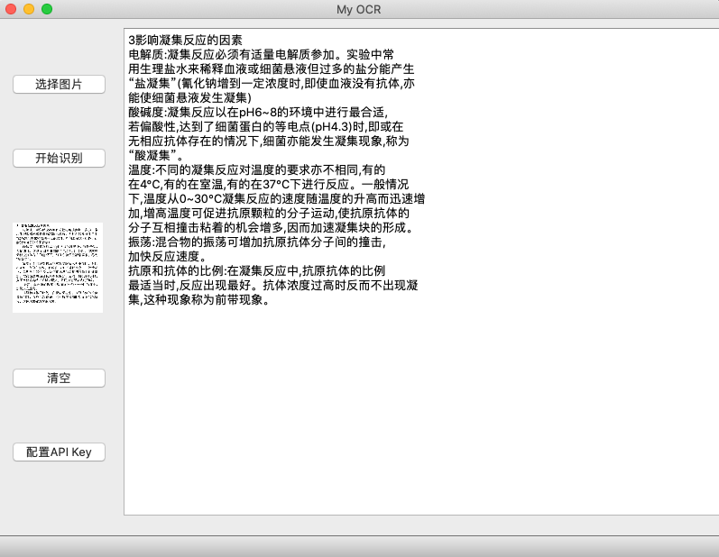

# OCR--PyQt5
基于PyQt5开发的OCR文字识别系统，调用了百度AI平台的API。

当前版本：0.50 beta



## 环境

- Python 3.6+
- PyQt5 5.14
- baidu-aip 2.2+

## 运行

- 配置API

    该项目自带了一个测试用的 API 实例，可将 app.py 中的实例更换为自己的API

    ```python
    PP_ID = '19105187'   #APP_ID
    API_KEY = 'IywiicFEKa5ny2ckUp29tHVk'  #API_KEY
    SECRET_KEY =  'uWnu44pu6lFjPZylFLMBymurGNTtrD2t'  #SECRET_KEY
    ```

- 运行

    `cd OCR-character-PyQt`

    `python app.py`


## 应用程序

- 该项目使用了`pyinstaller` 进行打包。可下载 application 目录下的的`My_OCR_0.50_beta.exe` 文件直接运行。

## 使用方法

- 点击 “选择图片” 选择需要识别的图片；
- 点击 “开始识别” 开始文字识别，结果将出现在右侧的文本框中；
- 点击 “清空”，将清除已选择的图片和文本框中的内容；
- 目前 “配置API Key” 选项还未绑定，可通过 app.py 中设置。


## 下一步

- 绑定 “配置API Key” 功能
- 加入截图功能
- 加入深色主题


## 反馈

在使用中如遇到任何问题，可在该项目中反馈，或联系作者：chenzixin7314@foxmail.com 